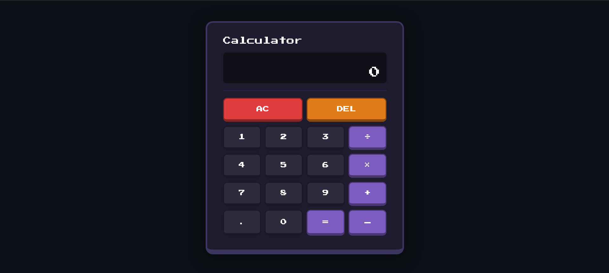

# 🧮 Calculator

A retro pixel-style calculator built with vanilla HTML, CSS, and JavaScript — no frameworks, no libraries, just the basics.



---

## ✨ Features

- Pixel / retro game aesthetic
- Press Start 2P font
- Press-down button effect
- Comma-formatted numbers (e.g. 1,000,000)
- 16-digit input limit per number
- Auto text shrink when numbers get long
- Expression shown on top, result on bottom
- Error and Overflow handling
- Full keyboard support

---

## ⌨️ Keyboard Shortcuts

| Key | Action |
|-----|--------|
| `0–9` | Number input |
| `+` `-` `*` `/` | Operators |
| `Enter` or `=` | Equals |
| `Backspace` | Delete last digit |
| `Escape` | Clear all (AC) |
| `.` | Decimal point |

---

## 📁 File Structure
calculator/

├── index.html
├── style.css
├── script.js
└── README.md

---

## 🚀 Getting Started

1. Clone the repo:
```bash
   git clone https://github.com/mors-codes/calculator.git
```

2. Open the folder:
```bash
   cd calculator
```

3. Open `index.html` in your browser — done!

> No installs, no build steps, no dependencies.

---

## 🛠️ Built With

- HTML5
- CSS3
- JavaScript (ES6+)
- [Press Start 2P](https://fonts.google.com/specimen/Press+Start+2P) — Google Fonts

---

## 📄 License

This project is open source and available under the [MIT License](LICENSE).
